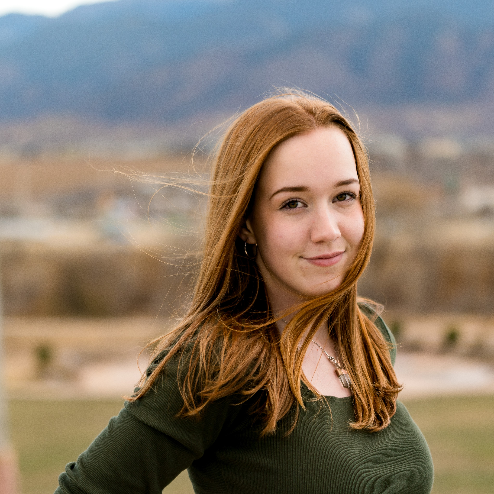

# **Katie Gonzalez**
---

Second-year goephysical engineering student at Colorado School of Mines. 

Golden, CO

[kgonzalez@mines.edu](mailto:kgonzalez@mines.edu)

## Education
### B.S. in Geophysical Engineering, Colorado School of Mines
- Vangaurd Scholar
- Caldwell Scholar Finalist
- John C. Hollister Scholarship in Geophysics

## Experience
- **Female Cabin Lead and Program Support**, YMCA Camp Shady Brook
- **HR Student Assistant**, Mines Human Resources

## Skills
- Version Control with Git and GitHub
- Python
- C++
- Oral and written communication 

## Projects and Coursework
- Geophysical Data Analysis (GPGN268)
- Mathematical Geophysics (GPGN229)
- Programming in C++ (CSCI200)
- Python Computing to Build a Sensor System (CSCI250)
- Engineering for Social and Environmental Responsibility (EDNS315)
- Design I (EDNS151)
    - Mobile, Large Volume Water Reservoir Pack for remote community use.
