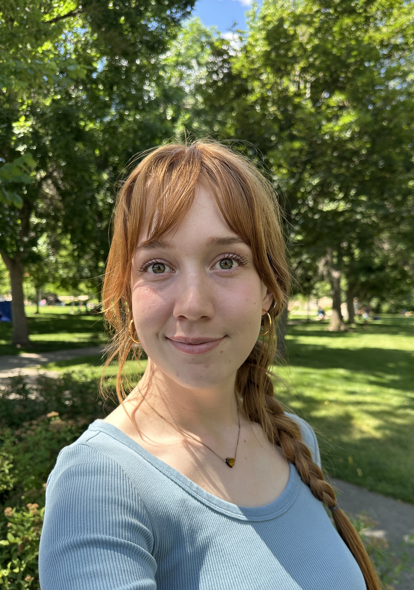

# Katie G. Gonzalez

### Geophysical Engineering Student, Class of 2026
**Colorado School of Mines** | *Golden, CO* 
[LinkedIn](https://www.linkedin.com/in/katie-gonzalez-109473217/) | [kgonzalez@mines.edu](mailto:kgonzalez@mines.edu)

---

## Technical Skills
**Languages:** Python, C++, LaTeX, PowerFX, Markdown \
**Tools:** Git, Excel, Matplotlib, RPi \
**Analysis:** Pandas, NumPy, SciPy, Seaborn \
**Platforms:** Windows, macOS, Linux (Debian, Ubuntu)

---

## Education

### B.Sc. in Geophysical Engineering
**Colorado School of Mines** | *Expected 2026*  
* GPA : 3.7/4.0
* Relevant Coursework: Geophysical Computing, Polar Cryosphere, Oceanography, Geohazards, Introduction to Data Science, Introduction to Programming in C++, Physics of the Earth I & II, Applied Geophysics I & II, Field Camp
* Dean’s List: 4 semesters 
* Hollister Student Award in Geophysics  
* Vanguard Community of Scholars

---

## Working Experience

### Undergraduate Student Researcher
**Colorado School of Mines** | *May 2025 - Present*

* Evaluating the performance of a global coupled ocean-atmosphere circulation model 
* Use Python computing to handle and process netCDF datasets
* Leverage statistics and spectral analysis to compare seasonality of winds in the California Current System region
* Presented research and findings at academic symposium

### Asset Management Intern
**Stantec Consulting Inc.** | *May 2024 - August 2024*

* Researched and proposed the use of a photogrammetry system for improved efficiency in large-scale tunnel inspection projects
* Worked in a team of inspectors to perform major biannual inspections of CDOT infrastructure
* Built PowerApps for field equipment and vehicle asset management 

### Cabin Lead Counselor
**YMCA Camp Shady Brook** | *May 2023 - August 2023*
* Practiced leadership and problem-solving to ensure the healt and safety at overnight summer camp
* Worked with other counselors to provide the best backcountry and frontcountry experience for campers
* Supported specialized programs requiring additional medical training and/or sensitivity

---

## Projects
### Geophysics Field Camp:
* Spatial variability of thermal and conductivity properties for detecting inlets in coves at Stagecoach Reservoir.

### Geohazards: 
* Avalanche hazard in high-traffic recreation areas in Colorado.

### Physics of the Earth II & Applied Geophysics II [Joint]: 
* Detecting orphaned borehole wells using UAV-based methods.

### Applications of Satellite Remote Sensing:
* Understanding the Airborne Snow Observatory's role in Western U.S. water resource management.

### Geophysical Data Analysis:  
* Humpback Chub species study using streamflow & capture history data.  