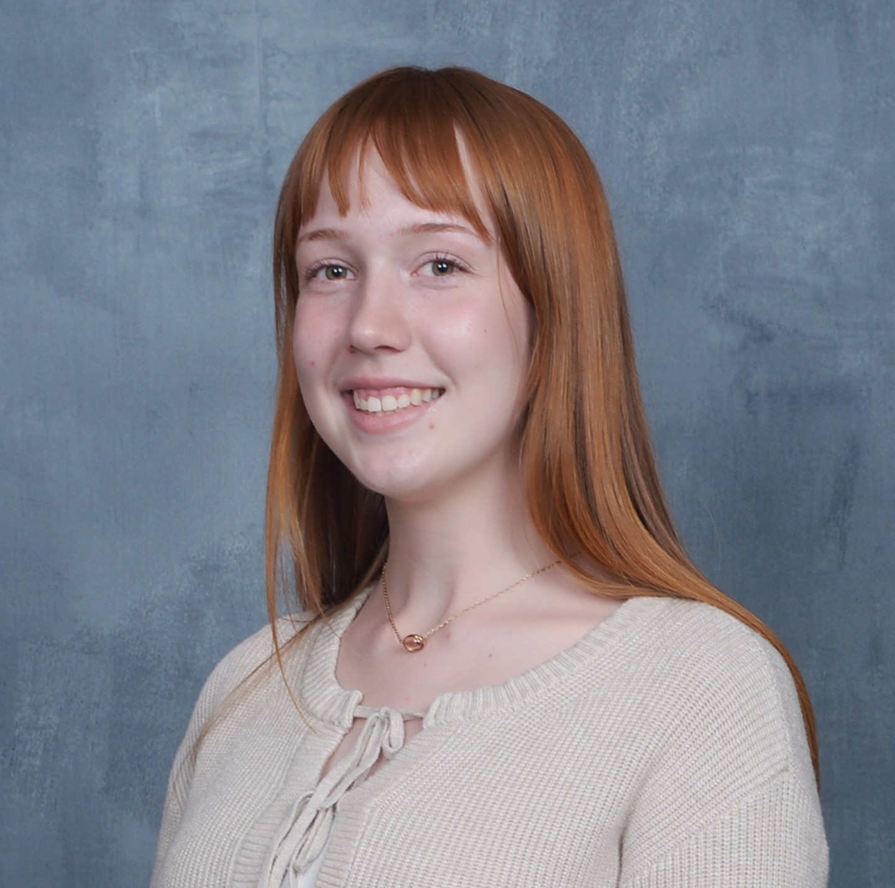

# Katie G. Gonzalez

### Geophysical Engineering Student, Class of 2026
**Colorado School of Mines** | *Golden, CO* \
[LinkedIn](https://www.linkedin.com/in/katie-gonzalez-109473217/) | [kgonzalez@mines.edu](mailto:kgonzalez@mines.edu)

---

## Technical Skills
**Languages:** Python, C++, LaTeX, PowerFX, Markdown \
**Tools:** Git, Excel, Matplotlib, RPi \
**Analysis:** Pandas, NumPy, SciPy, Seaborn, Xarray \
**Platforms:** Windows, macOS, Linux (Debian, Ubuntu) \
**Interpersonal:** Public speaking, scientific/technical writing, conflict management, emergency response, standard operating procedures (SOPs) \
**Other:** Adaptability, creative thinking, problem solving, idea generation, perseverance, time management 

---

## Education

### B.Sc. in Geophysical Engineering
**Colorado School of Mines** | *Expected 2026*  
* GPA : 3.69/4.0
* Relevant Coursework: Inversion, Geophysical Computing, Polar Cryosphere, Oceanography, Geohazards, Introduction to Data Science, Introduction to Programming in C++, Physics of the Earth I & II, Applied Geophysics I & II, Field Camp, Python Computing to Build A Sensor System
* Dean’s List: 5 semesters 
* Hollister Student Award in Geophysics  
* Vanguard Community of Scholars

---

## Working Experience

### Undergraduate Student Researcher
**Colorado School of Mines** | *May 2025 - Present*

* Evaluating the performance of a global coupled ocean-atmosphere circulation model 
* Use Python to filter, download, and process large netCDF datasets of buoy data and numerical model output
* Leverage statistics and spectral analysis to compare seasonality of winds in the California Current System region
* Presented work at an academic symposium to carefully and concisely explain the principles of air-sea coupling and numerical modeling
* Attended the American Geophysical Union (AGU) Fall Meeting 2025 

### Asset Management Intern
**Stantec Consulting Inc.** | *May 2024 - August 2024*

* Researched and proposed the use of a photogrammetry system for improved efficiency in large-scale tunnel inspection projects
* Performed major biannual overnight inspections of CDOT infrastructure in the Eisenhower-Johnson tunnel
* Performed data analysis on transportation survey data collected in and surrounding Denver metro 
* Built PowerApps for field equipment and vehicle asset management

### Cabin Lead Counselor
**YMCA Camp Shady Brook** | *May 2023 - August 2023*

* Practiced leadership and problem-solving to engage campers at overnight summer camp with a welcoming, enthusiastic, and fun environment
* Worked as a team with many other counselors to support the physical, emotional, and developmental well-being of campers and staff alike
* Supported specialized programs requiring additional medical training and sensitivity
* Maintained living spaces, common areas, historic buildings, activity grounds, campsites, and trails

### Human Resources Student Assistant
**Colorado School of Mines** | *January 2023 - May 2023*

* Digitized and filed classified employee human resources documents
* Posted labor law notices campus-wide

### Host
**Chuy's Restaurants** | *September 2021 - January 2024*

* Welcomed 50 to over 200 guests per shift and streamlined seating using POS system
* Communicated with back of house to prevent delays in the kitchen or bar
* Operated front of house retail, menu preparation, and cleanliness

---

## Projects

### Geophysics Senior Design:
* Retrofit a remotely-operated underwater vehicle with an extended arm and oceanographic instrument. Created a SOP and teaching materials for new ROV operation and Conductivity, Temperature, Depth instrument used at the Colorado School of Mines Geophysics Field Camp lake unit. Tested ways to monitor location of the ROV and data pipeline processing.

### Geophysics Field Camp:
* Spatial variability of thermal and conductivity properties for detecting inlets in coves at Stagecoach Reservoir.

### Geohazards: 
* Avalanche hazard in high-traffic recreation areas in Colorado.

### Physics of the Earth II & Applied Geophysics II [Joint]: 
* Detecting orphaned borehole wells using UAV-based methods.

### Applications of Satellite Remote Sensing:
* Understanding the Airborne Snow Observatory's role in Western U.S. water resource management.

### Geophysical Data Analysis:  
* Humpback Chub species study using streamflow & capture history data.  

---

## Volunteering

### Mines Without Borders - Education and Service Chair 
*April 2025 - May 2026*
Organized service and volunteering opportunities for MWB members in the greater Golden area related but limited to STEAM education, humanitarian engineering, sustainability, and international clubs. Provided supplementary training for members travelling to international projects. 

### National Science Foundation - Ice Core Facility Volunteer 
*April 2026 - May 2026*
Assisted the staff of the ICF with transporting and documenting over 100 ice cores segments as the foundation transitions to a new freezer facility.

### YMCA Camp Shady Brook - Halloween Camp Volunteer 
*October 2023, October 2024*

### Make it Mines - Student Society of Geophysics Volunteer 
*January 2026*